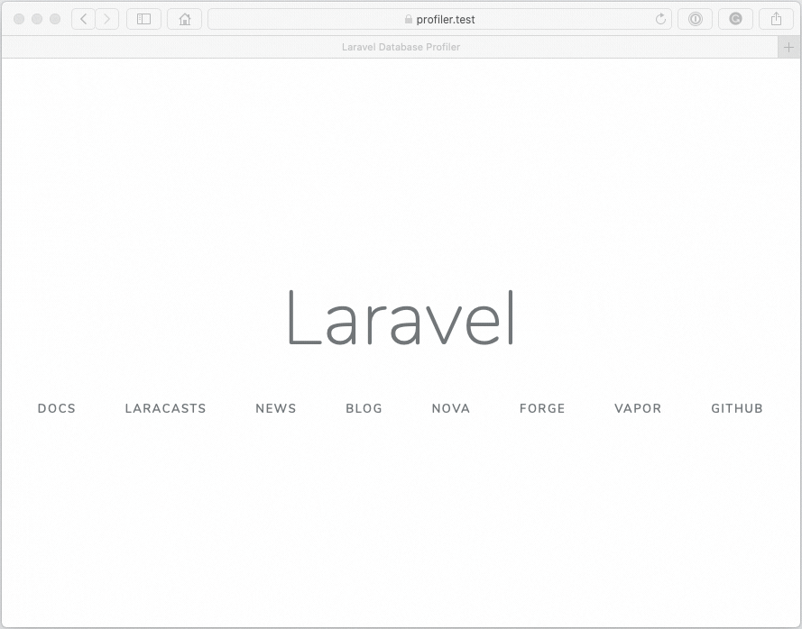
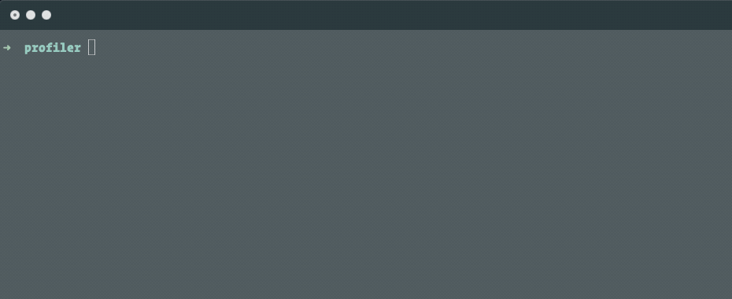

# Laravel Database Profiler

[](https://patreon.com/dmitryivanov)

[](https://styleci.io/repos/68023936)
[](https://travis-ci.com/dmitry-ivanov/laravel-db-profiler)
[](https://coveralls.io/github/dmitry-ivanov/laravel-db-profiler?branch=master)

[](https://packagist.org/packages/illuminated/db-profiler)
[](https://packagist.org/packages/illuminated/db-profiler)
[](https://packagist.org/packages/illuminated/db-profiler)
[](https://packagist.org/packages/illuminated/db-profiler)

Database Profiler for Laravel Web and Console Applications.

> A simple tool that works correctly even with `dd()` in your code.

| Laravel | Database Profiler                                                      |
| ------- | :--------------------------------------------------------------------: |
| 8.x     | [8.x](https://github.com/dmitry-ivanov/laravel-db-profiler/tree/8.x)   |
| 7.x     | [7.x](https://github.com/dmitry-ivanov/laravel-db-profiler/tree/7.x)   |
| 6.x     | [6.x](https://github.com/dmitry-ivanov/laravel-db-profiler/tree/6.x)   |
| 5.8.*   | [5.8.*](https://github.com/dmitry-ivanov/laravel-db-profiler/tree/5.8) |
| 5.7.*   | [5.7.*](https://github.com/dmitry-ivanov/laravel-db-profiler/tree/5.7) |
| 5.6.*   | [5.6.*](https://github.com/dmitry-ivanov/laravel-db-profiler/tree/5.6) |
| 5.5.*   | [5.5.*](https://github.com/dmitry-ivanov/laravel-db-profiler/tree/5.5) |
| 5.4.*   | [5.4.*](https://github.com/dmitry-ivanov/laravel-db-profiler/tree/5.4) |
| 5.3.*   | [5.3.*](https://github.com/dmitry-ivanov/laravel-db-profiler/tree/5.3) |
| 5.2.*   | [5.2.*](https://github.com/dmitry-ivanov/laravel-db-profiler/tree/5.2) |
| 5.1.*   | [5.1.*](https://github.com/dmitry-ivanov/laravel-db-profiler/tree/5.1) |

## Usage

1. Install the package via Composer:

    ```shell script
    composer require illuminated/db-profiler
    ```

2. Use the `vvv` parameter for Web:

    

3. Use the `-vvv` option for Console:

    

## Local by default

Enabled only for the `local` environment, so you don't have to worry about `production`.

If you want to force profiling for non-local environments - specify it explicitly in your `.env` file:

> DB_PROFILER_FORCE=true

## License

Laravel Database Profiler is open-sourced software licensed under the [MIT license](LICENSE.md).

[](https://patreon.com/dmitryivanov)
