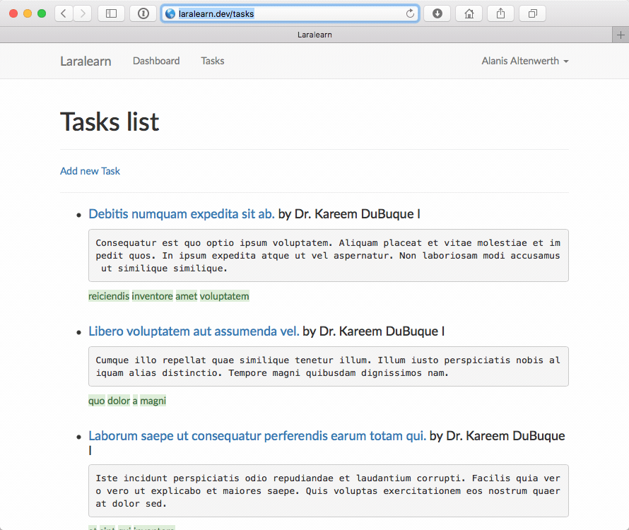

# Laravel Database Profiler

[](https://insight.sensiolabs.com/projects/8ec1928c-0727-427c-96e9-2a963eb6546b)

[](https://styleci.io/repos/68023936)
[](https://travis-ci.org/dmitry-ivanov/laravel-db-profiler)
[](https://coveralls.io/github/dmitry-ivanov/laravel-db-profiler?branch=5.2)

[](https://packagist.org/packages/illuminated/db-profiler)
[](https://packagist.org/packages/illuminated/db-profiler)
[](https://packagist.org/packages/illuminated/db-profiler)
[](https://packagist.org/packages/illuminated/db-profiler)

Provides database queries profiling for Laravel http and console applications.

Enabled only for `local` environment, you don't need to bother about `production`.

## Usage

1. Install package through `composer`:

    ```shell
    composer require "illuminated/db-profiler:5.2.*"
    ```

2. Add `DbProfilerServiceProvider` into `config/app.php`:

    ```php
    'providers' => [
        // ...
        Illuminated\Database\DbProfilerServiceProvider::class,
    ],
    ```

## HTTP Profiling

Use `vvv` request parameter for http profiling:



## Console Profiling

Use `-vvv` option for console profiling:


