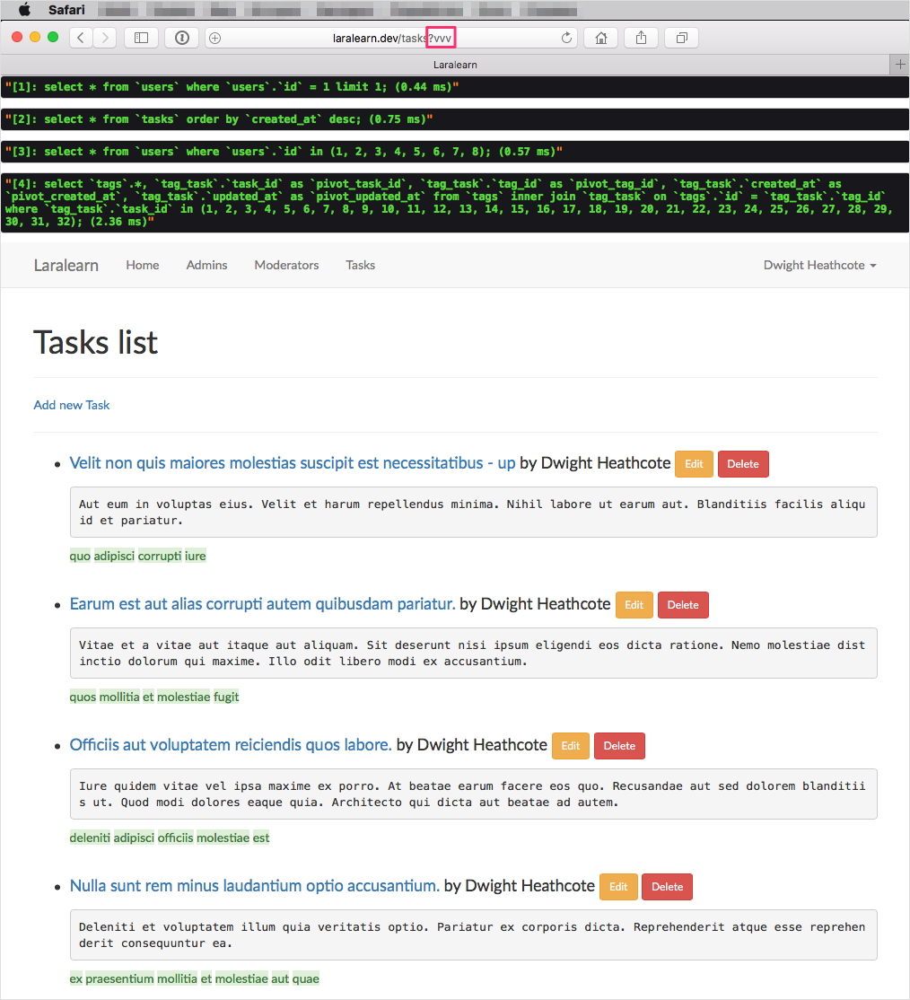
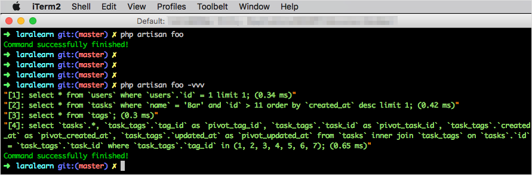

# Laravel database profiler

[](https://styleci.io/repos/68023936)
[](https://insight.sensiolabs.com/projects/8ec1928c-0727-427c-96e9-2a963eb6546b)

Provides database queries profiling for Laravel http and console applications.

## Requirements
- `PHP >=5.5.9`
- `Laravel >=5.2`

## Usage

1. Install package through `composer`:
    ```shell
    composer require illuminated/db-profiler
    ```

2. Add `ServiceProvider` into `config/app.php`:
    ```php
    'providers' => [
        // ...
        Illuminated\Database\Profiler\ServiceProvider::class,
    ],
    ```

3. Now you can use profiler (only for `local` environment)!

    Use `vvv` request parameter for http profiling:
    
    
    
    Or `-vvv` option for console profiling:
    
    
